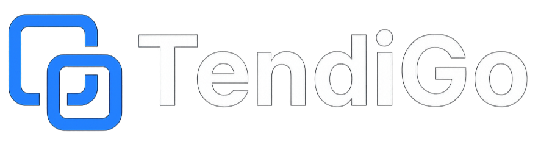

# Tendigo - Procurement Search & Management Platform

**Project Status: Prototype**

This application is a prototype developed as part of the "Service Engineering" module at the Free University of Berlin. It is under active development and serves for demonstration, study, and testing purposes.

---

## Table of Contents

- [About The Project](#about-the-project)
- [Key Features](#key-features)
- [Built With](#built-with)
- [Getting Started](#getting-started)
  - [Prerequisites](#prerequisites)
  - [Installation](#installation)
- [Project Structure](#project-structure)
- [Contact](#contact)

---

## About The Project

Tendigo is a web application designed to simplify the process of finding and managing public procurements and tenders in Germany. It aggregates data from hundreds of portals, providing a centralized platform with powerful search, AI-assisted analysis, and workflow management tools to help businesses discover and pursue relevant opportunities.



---

## Key Features

- **Centralized Search**: A main `Matching` page to search across all aggregated procurement data.
- **AI-Powered Search**:
    - **Smart Search**: Uses full-text search (FTS) for relevant and fast results on the main search bar.
    - **AI Assistant**: A chatbot panel to ask specific questions about any tender.
    - **AI Summaries**: An AI-generated summary of key information from original tender documents, available in a modal view.
- **Advanced Filtering**:
    - **Detailed Criteria**: Combine search terms with AND/OR/NOT logic and scope them to titles or descriptions.
    - **Geographic Filtering**: Draw polygons on a map to limit searches to specific areas.
    - **Date Filtering**: Filter by publication date or submission deadlines.
- **User Personalization & Workflow**:
    - **Authentication**: Secure user login, registration, and password reset powered by Supabase.
    - **Radar**: A personalized feed page based on user-defined and saved search profiles.
    - **Offer Cockpit**: A dashboard to manage bookmarked tenders. Users can track status, add notes, assign team members, and manage a todo list for each tender.
    - **Saved Searches**: Users can save complex search configurations to their profile to power the Radar feed and receive notifications.
- **Modern UI/UX**:
    - A clean, responsive dark-themed interface.
    - Interactive components like modals, an on-boarding tutorial, and loading animations.
    - An interactive map for geographic filtering.

---

## Built With

- **Frontend**: [React](https://reactjs.org/) (with Vite)
- **Routing**: [React Router](https://reactrouter.com/)
- **Authentication & DB**: [Supabase](https://supabase.io/)
- **HTTP Client**: [Axios](https://axios-http.com/)
- **UI Icons**: [Lucide React](https://lucide.dev/)
- **Mapping**: [Mapbox GL JS](https://www.mapbox.com/mapbox-gl-js) & [react-map-gl](https://visgl.github.io/react-map-gl/)
- **Styling**: CSS Modules, with global variables for a consistent theme.

---

## Getting Started

To get a local copy up and running, follow these simple steps.

### Prerequisites

You need Node.js and npm (or yarn) installed on your machine.

- npm
  ```sh
  npm install npm@latest -g
  ```

### Installation

1.  **Clone the repository**
    ```sh
    git clone https://github.com/your-username/tendigo.git
    cd tendigo
    ```

2.  **Install NPM packages**
    ```sh
    npm install
    ```

3.  **Set up environment variables**

    Create a `.env.local` file in the root directory and add your Supabase credentials. The application uses these to connect to the Supabase backend for authentication and saved searches.

    ```env
    VITE_SUPABASE_URL="YOUR_SUPABASE_URL"
    VITE_SUPABASE_ANON_KEY="YOUR_SUPABASE_ANON_KEY"
    ```

4.  **Run the development server**
    ```sh
    npm run dev
    ```
    The application will be available at `http://localhost:5173`.

---

## Project Structure

The project follows a standard React application structure, organizing files by their function.

```
/src
|
|-- /assets           # Static assets like images and logos
|
|-- /components       # Reusable UI components (common, layout, search)
|   |-- /common
|   |-- /layout
|   `-- /search
|
|-- /contexts         # React Context providers for global state (Auth, Settings)
|
|-- /hooks            # Custom React hooks for shared logic (search, modals, cookies)
|
|-- /pages            # Top-level page components for each route
|
|-- /services         # API communication layer (api.js, supabaseClient.js)
|
|-- /styles           # Global CSS files and variables
|
|-- App.jsx           # Main application component with routing setup
|
`-- main.jsx          # Entry point of the React application
```

---

## Contact

This is a university project.

**Project Team:**
- Felix Lange
- Fynn Grabowski - fynn.grabowski@fu-berlin.de
- Thao Nguyen
- Martin Drechsler
- Christopher Jung
